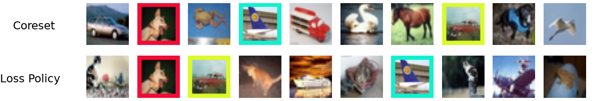

# Data-Efficient Augmentation for Training Neural Networks (NeurIPS 2022)


Official code repository for [Data-Efficient Augmentation for Training Neural Networks](https://arxiv.org/abs/2210.08363).

Authors: Tian Yu Liu and Baharan Mirzasoleiman


### Datasets
Create a `data/` folder in the main directory and place datasets there (e.g. Caltech256, TinyImageNet, ImageNet)

### Example Usage
Training on and augmenting 30% coresets on Caltech256
```
bash train.sh
```

Training on random and augmenting 50% coresets on ImageNet
```
bash train_imagenet.sh 
```

### Acknowledgements
- https://github.com/baharanm/craig
- https://github.com/google-research/augmix


If you find this useful for your work, please consider citing
```
@article{liu2022data,
  title={Data-Efficient Augmentation for Training Neural Networks},
  author={Liu, Tian Yu and Mirzasoleiman, Baharan},
  journal={Advances in Neural Information Processing Systems (NeurIPS)},
  year={2022}
}
```
